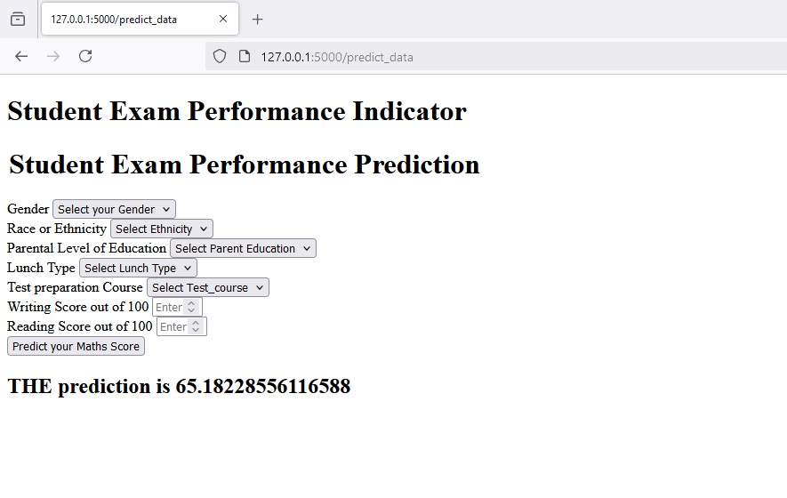

# End to End Machine Learing Project

This project is a simple ML where we need to predict math score of the students depending on the some other paramteres.
The dataset **data** folder.

### Video
Here you can find a small demo video of the Flask web application. It is very simple. The main purpose is to demonstrate how the notebook experiments gets converte into a finall application.

### Image

## There are a few interesting features that have been displayed in this project:

- How to orgainze an end-to-end ML project.
- how to create a simple Web UI using Flask.
- how to deploy this app in Amazon ElasticBeanStalk (EBS).

